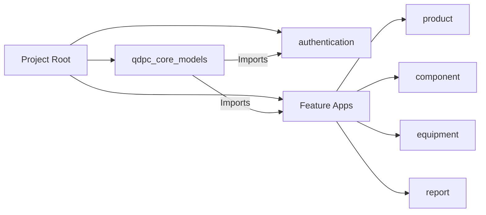
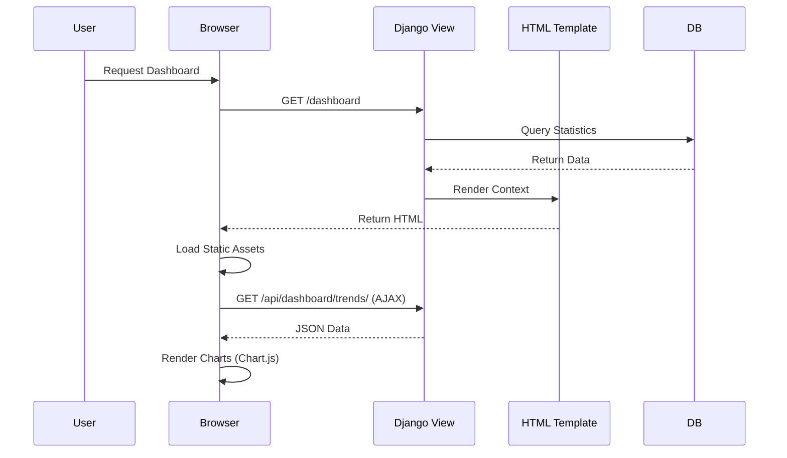
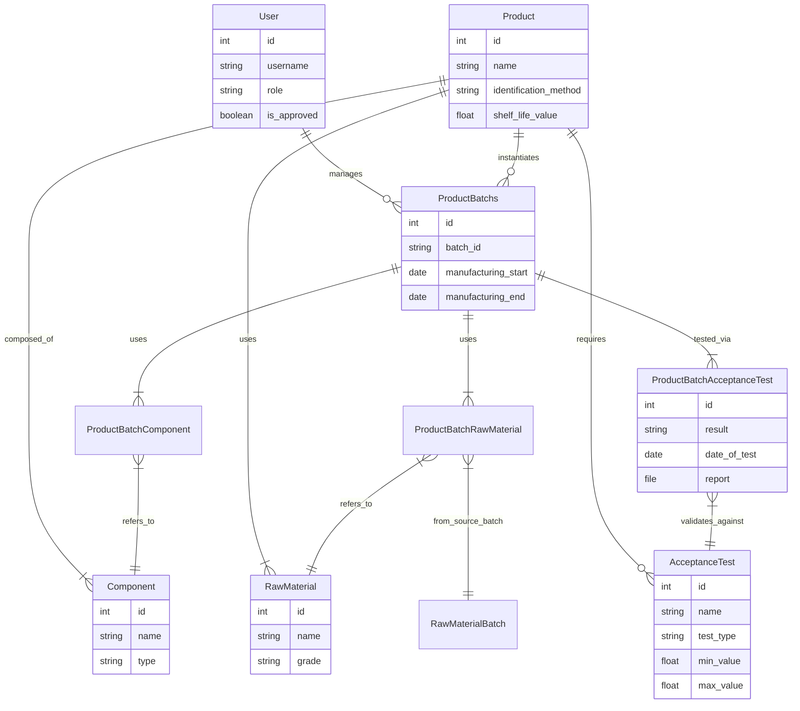
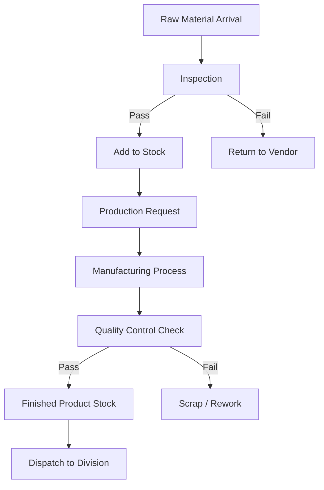
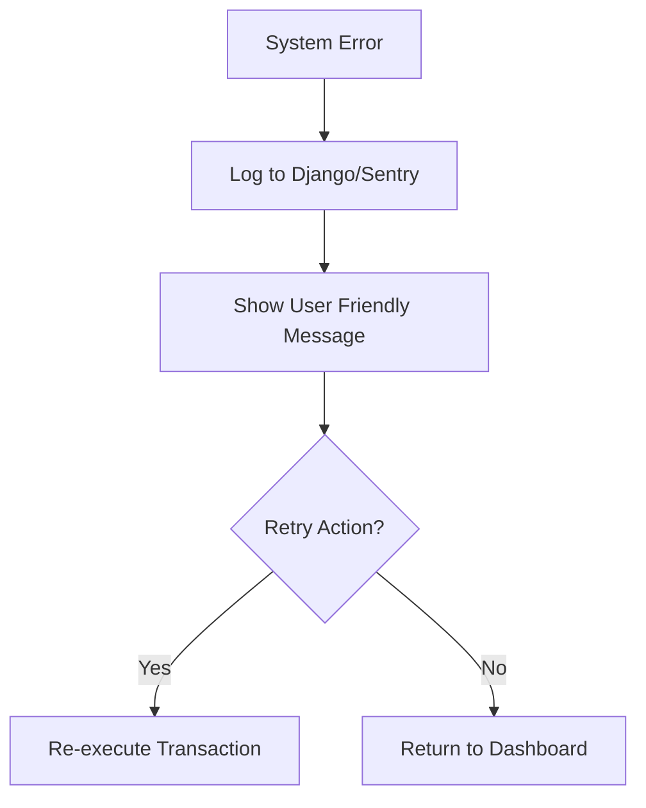

# VSSC-ISRO QDPC - Project Documentation

## 1. PROJECT OVERVIEW
**Project Name:** VSSC-ISRO QDPC (Quality Document Processing & Control)
**Business Domain:** Aerospace Quality Control & Supply Chain Management
**Purpose:** A comprehensive system for managing the quality control lifecycle of aerospace components, including raw materials, consumables, and finished products. It tracks batches, acceptance tests, processing agencies, and generates quality reports.

### Core Functionality
-   **Inventory Management:** Track Products, Components, Raw Materials, and Consumables.
-   **Quality Control:** Manage Acceptance Tests, Test Results, and Grade acceptances.
-   **Supply Chain:** Manage Suppliers, Sources, Processing Agencies, and Testing Agencies.
-   **User Management:** Role-based access control (RBAC) for various departments (Divisions, Centers).
-   **Reporting:** Generate PDF reports (QAR - Quality Assurance Reports) and value-added summaries.
-   **Dashboard:** Real-time visualization of inventory trends and resource status.

### Target Users
-   **Quality Managers:** Approval of batches, test results, and QARs.
-   **Lab Technicians:** Data entry for test results.
-   **Store Keepers:** Inventory tracking.
-   **Administrators:** System configuration and user management.

### Technology Stack
-   **Backend:** Django 5.0.4 (Python 3.x)
-   **API:** Django REST Framework 3.15
-   **Frontend:** Django Templates (Server-Side Rendering) + jQuery/Vanilla JS + Bootstrap (inferred)
-   **Database:** SQLite (Dev), MySQL (Prod-ready)
-   **PDF Generation:** ReportLab, xhtml2pdf
-   **Authentication:** Token-based (DRF) + Session-based (Django)

### Deployment Architecture
-   **Web Server:** Gunicorn/uWSGI (Recommended for Prod) behind Nginx.
-   **Database:** Hosted MySQL instance.
-   **Static Files:** Collected via `collectstatic` and served by Nginx.

---

## 2. COMPLETE FOLDER STRUCTURE ANALYSIS

### Tree Structure & Key Files
```text
VSSC-ISRO--QDPC/
├── authentication/         # Auth Logic (Views, Serializers, URLs)
│   ├── middleware.py       # Custom Auth Middleware
│   ├── urls.py             # Auth API endpoints
│   └── views/              # Login, Signup, Password Reset logic
├── component/              # Component Domain specific logic
├── consumable/             # Consumable Domain specific logic
├── equipment/              # Equipment Domain specific logic
├── process/                # Process Domain specific logic
├── product/                # Product Domain specific logic
├── qdpc/                   # MAIN PROJECT CONFIG
│   ├── settings.py         # Global Settings (Apps, DB, Middleware)
│   ├── urls.py             # Root URL Routing
│   └── views/              # Dashboard & Core Views
│       └── dashboard.py    # Analytics API endpoints
├── qdpc_core_models/       # SHARED DATA MODELS (Source of Truth)
│   └── models/             # Split Models Strategy
│       ├── user.py         # Custom User Model
│       ├── product.py      # Product Entity
│       ├── component.py    # Component Entity
│       └── ... (50+ model files)
├── report/                 # Report Generation Logic
├── stage_clearance/        # Workflow Approval Logic
├── static/                 # CSS, JS, Images (Assets)
├── templates/              # HTML Templates (Django)
│   ├── sidebar.html        # Navigation
│   ├── dashboard.html      # Main Dashboard
│   └── ... (60+ Templates)
├── user/                   # User Profile Management
├── manage.py               # Django CLI Entry Point
├── requirements.txt        # Python Dependencies
└── db.sqlite3              # Local Dev Database
```

### Critical Files
-   **Entry Point:** `manage.py` (CLI), `qdpc/wsgi.py` (Server).
-   **Configuration:** `qdpc/settings.py`.
-   **Data Definition:** `qdpc_core_models/models/*.py`.
-   **Routing:** `qdpc/urls.py`.

---

## 3. ARCHITECTURE DIAGRAMS

### A. High-Level System Architecture
```mermaid
graph TD
    User[Web Browser] -->|HTTP/HTTPS| Nginx[Nginx Reverse Proxy]
    Nginx -->|Gunicorn| Django[Django Web App]
    
    subgraph "Django Backend"
        Django --> Auth[Authentication App]
        Django --> Core[QDPC Core App]
        Django --> API[DRF API Layer]
        
        Auth --> Models[QDPC Core Models]
        Core --> Models
        API --> Models
    end
    
    subgraph "Data Layer"
        Models -->|ORM| SQL[(MySQL/SQLite)]
    end
    
    subgraph "Services"
        Django --> PDF[PDF Engine (xhtml2pdf)]
        Django --> Email[SMTP Service]
    end
```

### B. Module Organization


### D. Frontend/Backend Flow


---

## 4. DETAILED MODULE BREAKDOWN

### 1. `qdpc_core_models`
-   **Purpose:** Central repository for all database models to avoid circular imports and maintain schema consistency.
-   **Key Files:**
    -   `models/user.py`: Custom `User` model with `is_approved`, `role`, `centre`.
    -   `models/product.py`: `Product` entity with shelf life, identification logic.
    -   `models/acceptance_test.py`: Quality control benchmarks.
-   **Dependencies:** None (Base module).

### 2. `authentication`
-   **Purpose:** Handles User Authentication, Registration, and Password Management.
-   **Key Files:**
    -   `urls.py`: Routes for `/login`, `/sign-up`, `/forgot-password`.
    -   `views/signup_view.py`: Registration logic including Division/Center selection.
    -   `middleware.py`: `ThreadLocalMiddleware` for request tracking.

### 3. `qdpc` (Core)
-   **Purpose:** Project settings, Root URLs, and Dashboard Logic.
-   **Key Files:**
    -   `views/dashboard.py`: Renders statistics for the dashboard (API based).
    -   `urls.py`: Maps all feature apps to URL paths.

### 4. `product` / `component` / `consumable`
-   **Purpose:** Domain-specific logic (currently mostly relies on generic Views in `qdpc` or standard CRUD).
-   **Key Files:**
    -   `urls.py`: Domain specific routing.
    -   `views/`: Domain logic (if separate from core).

---

## 5. WORKFLOW & BUSINESS PROCESSES

### User Onboarding Flow
1.  **Sign Up:** User fills form -> Selects Center/Division -> Requests "Desired Salutation".
2.  **Verification:** Admin receives notification -> Verifies Identity -> Sets `is_approved=True`.
3.  **Access:** User logs in -> Middleware checks `is_active` and `is_approved`.

### Product Creation & Quality Control Workflow
1.  **Define Category & Product:** Admin creates Category/Product logic (Shelf life, BOM).
2.  **Batch Initiation:** User creates a `ProductBatch` (starts manufacturing lifecycle).
3.  **Inventory Allocation:** Link specific `RawMaterialBatch` and `ComponentBatch` to the `ProductBatch`.
4.  **Testing:**
    -   Perform `AcceptanceTest` (Quantitative/Qualitative).
    -   Upload Test Reports / Enter Values.
    -   System validates against Min/Max limits.
5.  **Quality Assurance Report (QAR):**
    -   System compiles all test results and batch info.
    -   Generates QAR PDF (e.g., `qar_report_template.html`).
    -   Manager reviews and approves QAR.
6.  **Final Approval:** Batch marked as "Cleared" for Dispatch.

---

## 6. API DOCUMENTATION
The system exposes REST APIs primarily for the Dashboard and dynamic UI elements.

### Dashboard APIs
| Endpoint | Method | Description | Response Example |
|----------|--------|-------------|------------------|
| `/api/dashboard/summary/` | GET | Summary counts | `{"products": {"count": 10}, "component": ...}` |
| `/api/dashboard/status/` | GET | Usage percentages | `[{"label": "Component in use", "value": 5, "total": 20}]` |
| `/api/dashboard/trends/` | GET | Monthly trends | `{"labels": ["Jan", ...], "datasets": [...]}` |

### Authentication APIs
| Endpoint | Method | Params | Description |
|----------|--------|--------|-------------|
| `/login/` | POST | `username`, `password` | Logs in user, returns Token/Session. |
| `/sign-up/` | POST | `username`, `email`, `password`, `division_id` | Registers new user. |

---

## 7. DATABASE SCHEMA

### Detailed Entity-Relationship Diagram


### Key Tables Explanation
**`ProductBatchs`**
The central entity for tracking production. It connects definitions (`Product`) with actual resources used (`ProductBatchRawMaterial`) and quality outcomes (`ProductBatchAcceptanceTest`).

**`AcceptanceTest`**
Defines the quality standards (Min/Max values, Units). These are instantiated per batch in `ProductBatchAcceptanceTest` where actual results are recorded.

**`User` & `Role`**
Users are linked to Divisions and Centers. Access is controlled via `is_approved` flag and `Role` assignment, ensuring only authorized personnel can approve QARs.

---

## 8. DEPLOYMENT & CONFIGURATION

### Prerequisites
-   Python 3.10+
-   MySQL 8.0+ (Production)
-   SMTP Server (for emails)

### Environment Variables (.env)
Create a `.env` file in the project root:
```ini
DEBUG=False
SECRET_KEY=your-production-secret-key-change-this
ALLOWED_HOSTS=yourdomain.com,10.0.0.1
DB_NAME=isro_new
DB_USER=admin
DB_PASSWORD=secure_password
DB_HOST=localhost
EMAIL_HOST_USER=gracelaboratorymangad@gmail.com
EMAIL_HOST_PASSWORD=your_app_password
```

### Production Checklist
1.  [ ] Set `DEBUG = False` in settings.
2.  [ ] Configure `ALLOWED_HOSTS`.
3.  [ ] Run `python manage.py collectstatic`.
4.  [ ] Configure Nginx to serve `/static/` and `/media/`.
5.  [ ] Use Gunicorn/uWSGI as the application server.

---

## 9. DEVELOPMENT SETUP

### Installation
1.  **Clone Repository**
    ```bash
    git clone https://github.com/Arunlal-M/VSSC-ISRO--QDPC.git
    cd VSSC-ISRO--QDPC
    ```

2.  **Create Virtual Environment**
    ```bash
    python -m venv env
    source env/bin/activate  # Windows: env\Scripts\activate
    ```

3.  **Install Dependencies**
    ```bash
    pip install -r requirements.txt
    ```

4.  **Database Migration**
    ```bash
    python manage.py makemigrations
    python manage.py migrate
    ```

5.  **Create Superuser**
    ```bash
    python manage.py createsuperuser
    ```

6.  **Run Server**
    ```bash
    python manage.py runserver
    ```

7.  **Access App**
    Open `http://127.0.0.1:8000` in your browser.

---

## 10. INTERACTIVE WORKFLOW CHARTS

### A. Core Business Process


### B. Error Recovery

